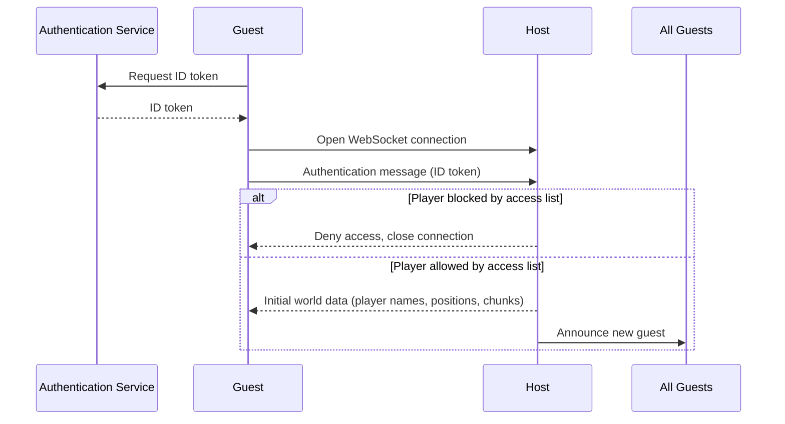
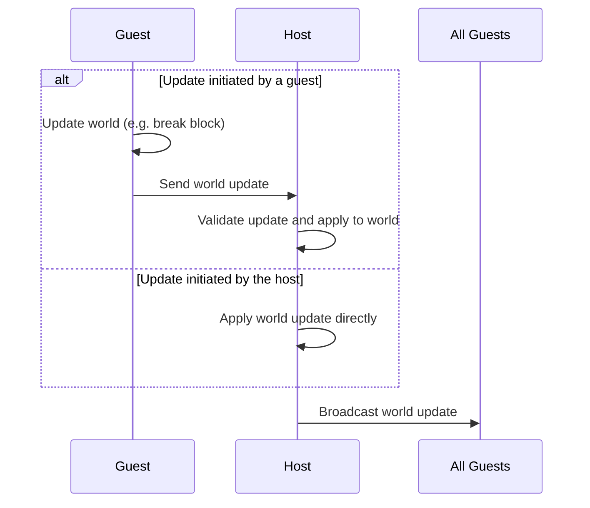
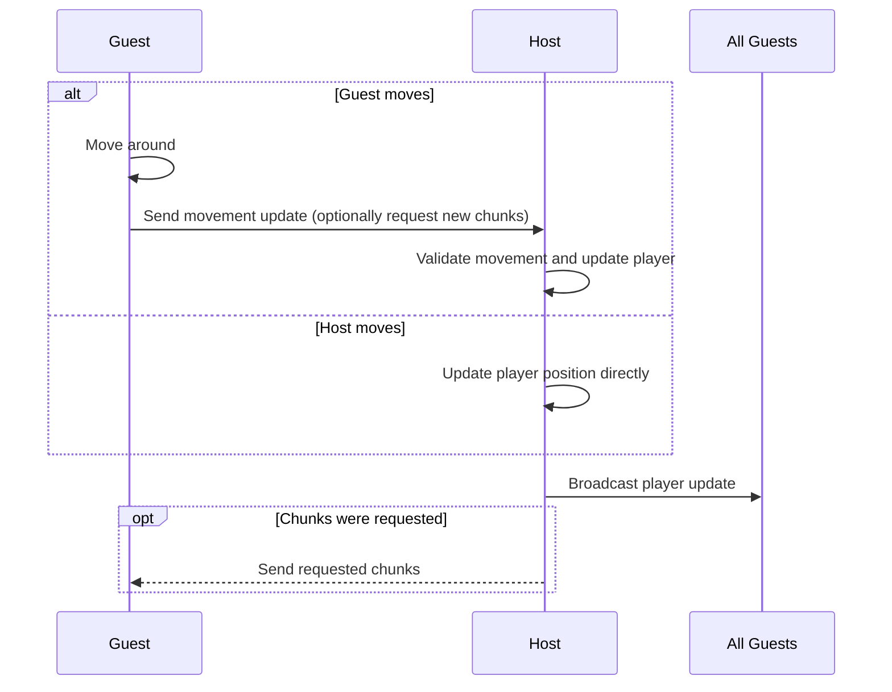

## Security

There are three token types:

- ID token: Sent to the host to identify the guest
- Access token: Sent to the API to make authenticated requests
- Refresh token: Sent to the API to request a new set of tokens

The ID and access tokens have a short lifetime to limit the time in which stolen tokens can be used by unauthorized
actors. The refresh token has a longer lifetime so the player does not need to log in all the time.

The distinction between ID and access tokens is to prevent multiplayer hosts from making authorized
API requests as one of their guests (CWE-668).

## Host-to-Guest Communication

### Joining

### World Updates (Example: Breaking Blocks)

### Movement

